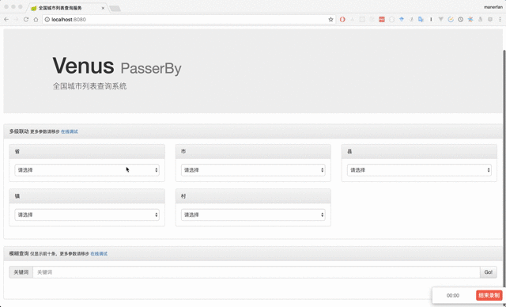
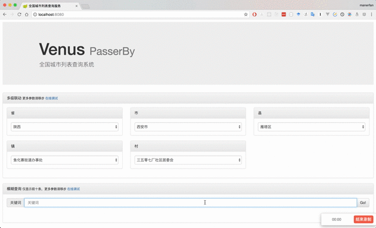

# venus-passerby

全国城市列表查询服务





## 使用的组件

SpringBoot + Sqlite3

## Docker运行

```
docker run -d --rm --name venus -p 8080:1531 manerfan/venus-passerby
```

访问 `http://localhost:8080`

## Jar包运行

下载 venus-passerby-1.0.0.zip 并解压到 /var/lib/venus

下载 region.db 到 /var/lib/venus

进入/var/lib/venus目录执行

```
./venus-passerby.jar start
```

